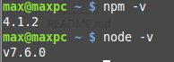

###check npm and node version        
```
npm -v       
node -v      
```                             
                   
             
###    
```
npm init -y
```       
     
###add dependencies          
```
npm i -S react react-dom
```          
           
###add devDependencies            
```
npm i -D babel-core babel-loader babel-preset-es2015 babel-preset-react react-hot-loader webpack webpack-dev-server
```           
        
###install webpack and webpack-dev-server globally        
```
npm i -g webpack webpack-dev-server
```         
         

